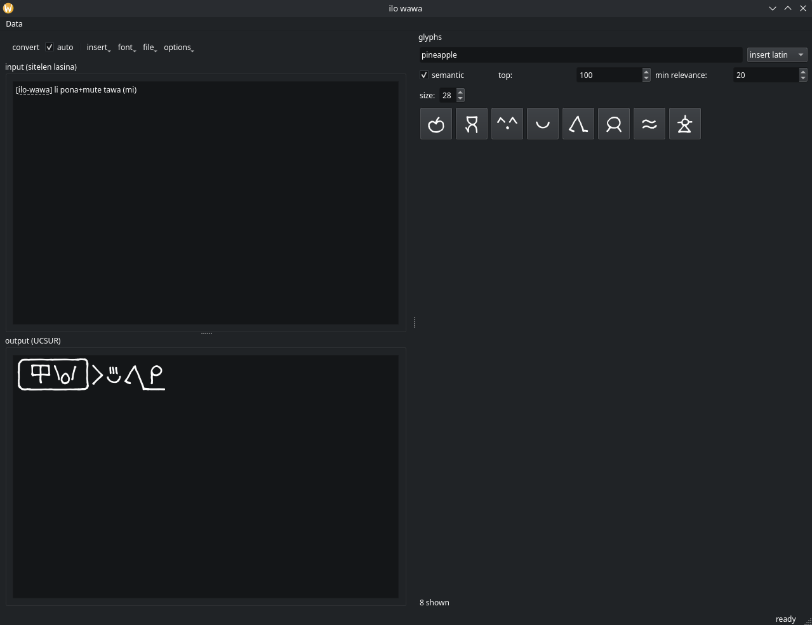
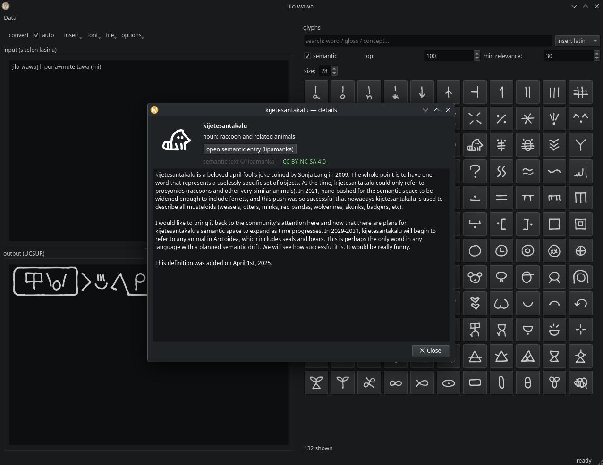

## **󱤎󱦕󱥵 ilo-wawa (sitelen pona education + semantic engine)**

<p align="center">
  
  
</p>

**ilo-wawa** is a desktop tool for learning about and writing toki pona in UCSUR sitelen pona glyphs, now with optional semantic search powered by spaCy + a tatoeba-derived corpus.

supports **juniko (extended)**, **nasin-nanpa**, and custom UCSUR fonts.

try **ilo-wawa lili** (for web/no semantic search) here: [ilo-wawa lili](https://calibancode.github.io/ilo-wawa/)

features:

* realtime sitelen-lasina -> UCSUR conversion
* full glyph palette (primary glyphs + juniko supplementary)
* semantic search (vector similarity over english sentences)
* keyword search (word, gloss, long semantic text)
* smart insertion rules (spacing, joiners, stack joins, etc.)
* glyph details dialog w/ full semantic descriptions
* copy as glyphs or as codepoints
* unicode joiner support (ZWJ/ZWNJ + UCSUR controls)
* toggleable ASCII->UCSUR mapping
* file open/save
* customizable font + font size

requirements:

```
pip install -r requirements.txt
cd tp
python3 app.py
```

recommended to use a virtual environment.

### project size note

> **final footprint after the first run is ~1.8 GB.**
> this includes the venv, spaCy model, and cached semantic-vector data.
>
> too much power? swap the model out for `en_core_web_md` in [ui_palette.py](tp/ui_palette.py): `python -m spacy download en_core_web_md`
>
> alternatively, try out [ilo-wawa lili](https://calibancode.github.io/ilo-wawa/) for a browser-only experience without semantic search

## licensing

**code** (all .py files):
GPLv3

**semantic data** (`tp_semantic_spaces.json`):
© lipamanka — CC BY-NC-SA 4.0

**Tatoeba translation corpus** (`tatoeba_tp.tsv`):
MIT license

**sitelen seli kiwen juniko** (`fonts/juniko.*`):
SIL Open Font license

**nasin-nanpa** (`fonts/nasin-nanpa.*`):
MIT license

these licenses apply to their respective components only.
my code is GPLv3; the bundled data remains under its original license.
